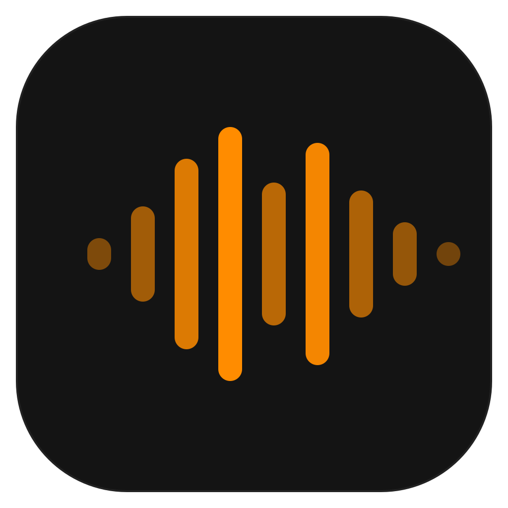

<p align="center">
  <picture>
    <source media="(prefers-color-scheme: dark)" srcset="svg/logo-5-dark-1024.png" />
    <source media="(prefers-color-scheme: light)" srcset="svg/logo-5-light-1024.png" />
    
  </picture>
</p>

<h1 align="center">Handless</h1>

<p align="center">
  <strong>A free, open source, and extensible speech-to-text application with local and cloud options.</strong>
</p>

<p align="center">
  <a href="https://github.com/ElwinLiu/handless/actions/workflows/build-test.yml"></a>
  <a href="https://github.com/ElwinLiu/handless/actions/workflows/lint.yml"></a>
  <a href="LICENSE"></a>
</p>

Handless is a cross-platform desktop application for speech transcription. Press a shortcut, speak, and have your words appear in any text field. Run everything locally for full privacy, or use cloud APIs for convenience -- your choice.

Forked from [Handy](https://github.com/cjpais/Handy) v0.7.8.

## Table of Contents

- [Why Handless?](#why-handless)
- [How It Works](#how-it-works)
- [Features](#features)
- [Getting Started](#getting-started)
- [CLI Parameters](#cli-parameters)
- [Known Issues](#known-issues)
- [Linux Notes](#linux-notes)
- [Troubleshooting](#troubleshooting)
- [Contributing](#contributing)
- [License](#license)
- [Acknowledgments](#acknowledgments)

## Why Handless?

- **Free**: Accessibility tooling belongs in everyone's hands, not behind a paywall
- **Open Source**: Together we can build further. Extend Handless for yourself and contribute to something bigger
- **Private by default**: Transcribe entirely on-device with local models, or opt in to cloud APIs when you prefer
- **Simple**: One tool, one job. Transcribe what you say and put it into a text box

Handless isn't trying to be the best speech-to-text app -- it's trying to be the most forkable one.

## How It Works

1. **Press** a configurable keyboard shortcut to start/stop recording (or use push-to-talk mode)
2. **Speak** your words while the shortcut is active
3. **Release** and Handless processes your speech using your chosen model
4. **Get** your transcribed text pasted directly into whatever app you're using

## Features

- **Local transcription** with a variety of built-in models -- browse and download them in Settings
- **Voice Activity Detection** to filter silence (local models only)
- **Cloud STT** support via OpenAI or Soniox
- **LLM post-processing** to clean up, reformat, or restructure transcriptions
- **Cross-platform**: macOS (Intel & Apple Silicon), Windows (x64), Linux (x64)
- **Available in 17 languages**

## Getting Started

### Install

**macOS (Homebrew):**

```sh
brew tap ElwinLiu/tap
brew install --cask handless
```

**Other platforms:** Download the latest release from the [releases page](https://github.com/ElwinLiu/handless/releases).

### Setup

1. Launch Handless and grant necessary system permissions (microphone, accessibility)
2. Configure your preferred keyboard shortcuts in Settings
3. Start transcribing!

To build from source, see [BUILD.md](BUILD.md).

## CLI Parameters

Handless supports command-line flags for controlling a running instance and customizing startup behavior.

**Remote control flags** (sent to an already-running instance):

```bash
handless --toggle-transcription    # Toggle recording on/off
handless --toggle-post-process     # Toggle recording with post-processing on/off
handless --cancel                  # Cancel the current operation
```

**Startup flags:**

```bash
handless --start-hidden            # Start without showing the main window
handless --no-tray                 # Start without the system tray icon
handless --debug                   # Enable debug mode with verbose logging
handless --help                    # Show all available flags
```

Flags can be combined: `handless --start-hidden --no-tray`

> **macOS tip:** When installed as an app bundle, invoke the binary directly:
>
> ```bash
> /Applications/Handless.app/Contents/MacOS/Handless --toggle-transcription
> ```

## Known Issues

This project is actively being developed. See all [known issues](https://github.com/elwin/handless/issues).

**Wayland Support (Linux):**

- Limited support for Wayland display server
- Requires [`wtype`](https://github.com/atx/wtype) or [`dotool`](https://sr.ht/~geb/dotool/) for text input (see [Linux Notes](#linux-notes))

## Linux Notes

### Text Input Tools

For reliable text input on Linux, install the appropriate tool for your display server:

| Display Server | Recommended Tool | Install Command                                    |
| -------------- | ---------------- | -------------------------------------------------- |
| X11            | `xdotool`        | `sudo apt install xdotool`                         |
| Wayland        | `wtype`          | `sudo apt install wtype`                           |
| Both           | `dotool`         | `sudo apt install dotool` (requires `input` group) |

- **dotool setup**: Add your user to the `input` group: `sudo usermod -aG input $USER` (then log out and back in)

Without these tools, Handless falls back to enigo which may have limited compatibility, especially on Wayland.

### Runtime Dependencies

Handless links `gtk-layer-shell` on Linux. If startup fails with `error while loading shared libraries: libgtk-layer-shell.so.0`:

| Distro        | Package               | Command                                |
| ------------- | --------------------- | -------------------------------------- |
| Ubuntu/Debian | `libgtk-layer-shell0` | `sudo apt install libgtk-layer-shell0` |
| Fedora/RHEL   | `gtk-layer-shell`     | `sudo dnf install gtk-layer-shell`     |
| Arch Linux    | `gtk-layer-shell`     | `sudo pacman -S gtk-layer-shell`       |

For building from source on Ubuntu/Debian, you may also need `libgtk-layer-shell-dev`.

### Other Notes

- The recording overlay is disabled by default (`Overlay Position: None`) because certain compositors treat it as the active window, which can steal focus and prevent pasting.
- Running with `WEBKIT_DISABLE_DMABUF_RENDERER=1` may help if you experience issues.

### Global Keyboard Shortcuts (Wayland)

On Wayland, system-level shortcuts must be configured through your desktop environment or window manager. Use the [CLI flags](#cli-parameters) as the command.

**GNOME:**

1. Open **Settings > Keyboard > Keyboard Shortcuts > Custom Shortcuts**
2. Click **+**, set **Name** to `Toggle Handless Transcription`
3. Set **Command** to `handless --toggle-transcription`
4. Click **Set Shortcut** and press your desired key combination

**KDE Plasma:**

1. Open **System Settings > Shortcuts > Custom Shortcuts**
2. Click **Edit > New > Global Shortcut > Command/URL**
3. Set your desired key combination and command `handless --toggle-transcription`

**Sway / i3:**

```ini
bindsym $mod+o exec handless --toggle-transcription
```

**Hyprland:**

```ini
bind = $mainMod, O, exec, handless --toggle-transcription
```

### Unix Signals

You can also control Handless via Unix signals:

| Signal    | Action                                    | Example                   |
| --------- | ----------------------------------------- | ------------------------- |
| `SIGUSR2` | Toggle transcription                      | `pkill -USR2 -n handless` |
| `SIGUSR1` | Toggle transcription with post-processing | `pkill -USR1 -n handless` |

Example Sway config:

```ini
bindsym $mod+o exec pkill -USR2 -n handless
bindsym $mod+p exec pkill -USR1 -n handless
```

## Troubleshooting

### Debug Mode

Press `Cmd+Shift+D` (macOS) or `Ctrl+Shift+D` (Windows/Linux) to open the debug panel.

## Contributing

Contributions are welcome! See [CONTRIBUTING.md](CONTRIBUTING.md) for setup, workflow, and guidelines. For translations, see [CONTRIBUTING_TRANSLATIONS.md](CONTRIBUTING_TRANSLATIONS.md).

## License

MIT License -- see [LICENSE](LICENSE) for details.

## Acknowledgments

- **Whisper** by OpenAI for the speech recognition model
- **whisper.cpp and ggml** for cross-platform whisper inference/acceleration
- **NVIDIA NeMo** for the Parakeet speech recognition models
- **Moonshine** by Useful Sensors for lightweight speech recognition
- **SenseVoice** by FunAudioLLM for multilingual speech recognition
- **Silero** for lightweight VAD
- **Tauri** for the Rust-based app framework
- **[Handy](https://github.com/cjpais/Handy)** -- the upstream project this was forked from
- **Community contributors** helping make Handless better

---

_"Your search for the right speech-to-text tool can end here -- not because Handless is perfect, but because you can make it perfect for you."_
