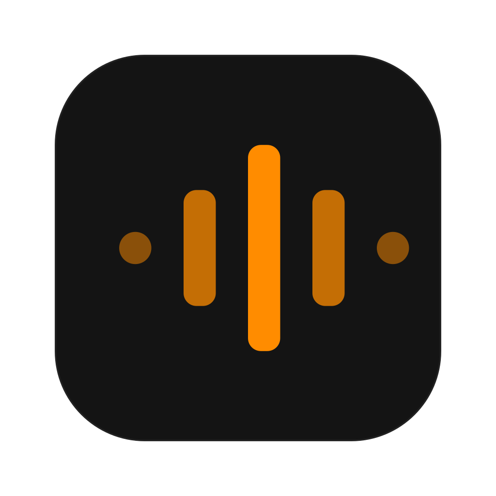

<p align="center">
  
</p>

<h1 align="center">Handless</h1>

<p align="center">
  Riconoscimento vocale gratuito e open-source per macOS.<br/>
  Premi una scorciatoia, parla, ottieni il testo in qualsiasi app. Esegui in locale per la privacy o usa le API cloud.
</p>

<p align="center">
  <a href="https://handless.elwin.cc"></a>
  <a href="https://github.com/ElwinLiu/handless/actions/workflows/build-test.yml"></a>
  <a href="https://github.com/ElwinLiu/handless/actions/workflows/lint.yml"></a>
  <a href="../LICENSE"></a>
</p>

<p align="center">
  <a href="../README.md">English</a> ·
  <a href="README.zh.md">简体中文</a> ·
  <a href="README.zh-TW.md">繁體中文</a> ·
  <a href="README.ja.md">日本語</a> ·
  <a href="README.ko.md">한국어</a> ·
  <a href="README.es.md">Español</a> ·
  <a href="README.fr.md">Français</a> ·
  <a href="README.de.md">Deutsch</a> ·
  <a href="README.pt.md">Português</a> ·
  <a href="README.ru.md">Русский</a> ·
  <a href="README.ar.md">العربية</a> ·
  <b>Italiano</b> ·
  <a href="README.tr.md">Türkçe</a> ·
  <a href="README.uk.md">Українська</a> ·
  <a href="README.vi.md">Tiếng Việt</a> ·
  <a href="README.pl.md">Polski</a> ·
  <a href="README.cs.md">Čeština</a>
</p>

## Funzionalità

- **Trascrizione locale** -- scarica i modelli nelle Impostazioni, funziona interamente sul dispositivo
- **Cloud STT** tramite OpenAI o Soniox
- **Rilevamento attività vocale** (solo modelli locali)
- **Post-elaborazione LLM** per ripulire o riformattare le trascrizioni
- **macOS** (Intel & Apple Silicon)
- **17 lingue**

## Installazione

**macOS (Homebrew):**

```sh
brew tap ElwinLiu/tap
brew install --cask handless
```

Compilare dal sorgente: vedi [BUILD.md](../BUILD.md).

## CLI

**Controllo remoto** (comunica con un'istanza in esecuzione):

```bash
handless --toggle-transcription    # Attiva/disattiva la registrazione
handless --toggle-post-process     # Attiva/disattiva registrazione + post-elaborazione
handless --cancel                  # Annulla l'operazione in corso
```

**Opzioni di avvio:**

```bash
handless --start-hidden            # Nessuna finestra principale
handless --no-tray                 # Nessuna icona nel vassoio
handless --debug                   # Log dettagliato
handless --help                    # Tutte le opzioni
```

Combinabili liberamente: `handless --start-hidden --no-tray`

> **macOS:** invoca il binario direttamente: `/Applications/Handless.app/Contents/MacOS/Handless --toggle-transcription`

## Risoluzione dei problemi

`Cmd+Shift+D` apre il pannello di debug.

## Contribuire

Vedi [CONTRIBUTING.md](../CONTRIBUTING.md). Per le traduzioni: [CONTRIBUTING_TRANSLATIONS.md](../CONTRIBUTING_TRANSLATIONS.md).

## Licenza

[MIT](../LICENSE)

## Ringraziamenti

Derivato da [Handy](https://github.com/cjpais/Handy) v0.7.8.

[Whisper](https://github.com/openai/whisper) | [whisper.cpp](https://github.com/ggerganov/whisper.cpp) | [NeMo Parakeet](https://github.com/NVIDIA/NeMo) | [Moonshine](https://github.com/usefulsensors/moonshine) | [SenseVoice](https://github.com/FunAudioLLM/SenseVoice) | [Silero VAD](https://github.com/snakers4/silero-vad) | [Tauri](https://tauri.app) | [Handy](https://github.com/cjpais/Handy)
